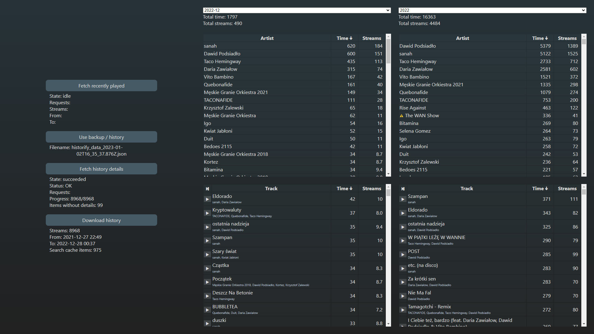

# Historify

**Primitive Spotify history extractor**



## Before you start

Go to https://www.spotify.com/us/account/privacy/ -> _Download your data_ -> Request (extended) streaming history

**This takes at least a few days!**

## Setup

1. Go to https://developer.spotify.com/dashboard/applications and create your app in order to obtain a Client ID and a Client secret.
2. Create a `.env` file as described below.
3. Make sure you have a correct Node version installed. Recommended version is in a `.nvmrc` file.
4. `npm i`
5. `npm run dev`

Tip: _Fetch history details_ button will... fetch the details of every history item (or at least it will try to), **but** it will stop if there is any error. If the error is in 5xx range, just click the button again... and keep repeating the whole process as long as the _Items without details_ keeps getting smaller. Yes, this could be automated but I've already spent way more time than I wanted on this app. Also, remember to do backups using the last button!

## `.env` file

```
VITE_CLIENT_ID=abc123
VITE_CLIENT_SECRET=def456
VITE_REDIRECT_URI=http://localhost:8080/callback
```

## ToDo

- https://developer.spotify.com/documentation/web-api/reference/#/operations/get-users-top-artists-and-tracks
- cache only matching result (?)
- Errors, token expiration, refreshing
